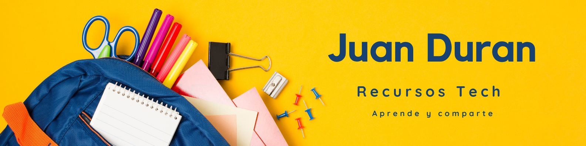

# 📘 Mi Biblioteca Tech: recursos que he creado y compartido

¡Hola! Soy Juan 👋 y este repositorio es mi forma de centralizar todo lo que voy aprendiendo, explicando y compartiendo sobre tecnología: desde Python y análisis de datos hasta DevOps, IA y más.

Si te gusta aprender de forma práctica, visual y con materiales claros, este repo es para ti 🚀

---

## 🧭 Índice de contenidos

### 🔧 Fundamentos de Programación y Entorno
- [Python (general)](./1_Fundamentos/Python.pdf)
- [Buenas prácticas en Python](./1_Fundamentos/Buenas_practicas_Python.pdf)
- [Automatización con Python](./1_Fundamentos/Automatizacion_Python.pdf)
- [Testing en Python](./1_Fundamentos/Testing_Python.pdf)
- [Pytest](./1_Fundamentos/Pytest.pdf)
- [IDEs](./1_Fundamentos/IDEs.pdf)
- [Git y GitHub](./1_Fundamentos/Git_y_GitHub.pdf)

---

### 🗃️ Gestión de Datos
- [Bases de datos](./2_Gestion_Datos/Bases_de_datos.pdf)
- [Obtención de datos](./2_Gestion_Datos/Obtencion_datos.pdf)
- [Limpieza de datos con Python](./2_Gestion_Datos/Limpieza_datos_Python.pdf)
- [Web Scraping](./2_Gestion_Datos/Web_Scraping.pdf)
- [APIs](./2_Gestion_Datos/APIs.pdf)

---

### 📊 Análisis y Visualización de Datos
- [Tipos de gráficos](./3_Analisis_Visualizacion/Tipos_graficos.pdf)
- [Visualización de datos con Python](./3_Analisis_Visualizacion/Visualizacion_Python.pdf)
- [Herramientas en análisis de datos](./3_Analisis_Visualizacion/Herramientas_Analisis.pdf)
- [Herramientas de visualización](./3_Analisis_Visualizacion/Herramientas_Visualizacion.pdf)
- [Power BI](./3_Analisis_Visualizacion/PowerBI.pdf)
- [DAX en Power BI](./3_Analisis_Visualizacion/DAX_en_PowerBI.pdf)

---

### 🤖 Machine Learning e Inteligencia Artificial
- [Machine Learning](./4_ML_IA/Machine_Learning.pdf)
- [Proyectos de ML](./4_ML_IA/Proyectos_ML.pdf)
- [Deep Learning](./4_ML_IA/Deep_Learning.pdf)
- [Herramientas de IA - Parte 1](./4_ML_IA/Herramientas_IA_1.pdf)
- [Herramientas de IA - Parte 2](./4_ML_IA/Herramientas_IA_2.pdf)

---

### 📈 Roadmaps y Especialización
- [Roadmap to Python](./5_Roadmaps/Roadmap_Python.pdf)
- [Roadmap to Data Analyst](./5_Roadmaps/Roadmap_Data_Analyst.pdf)
- [Roadmap to Data Scientist](./5_Roadmaps/Roadmap_Data_Scientist.pdf)

---

### ⚙️ Despliegue y Desarrollo
- [Desarrollo Web](./6_Desarrollo/Desarrollo_Web.pdf)
- [Streamlit](./6_Desarrollo/Streamlit.pdf)
- [Docker](./6_Desarrollo/Docker.pdf)
- [DevOps](./6_Desarrollo/DevOps.pdf)

---

### 🧠 Carrera y Trabajo en Datos
- [Roles en Datos](./7_Carrera/Roles_en_Datos.pdf)
- [Metodología Ágil](./7_Carrera/Metodologia_Agil.pdf)

---

### 🎮 Proyectos y Otros Recursos
- [Pygame](./8_Otros/Pygame.pdf)

---

## 🤝 ¿Te resultó útil?
Puedes clonar, compartir o adaptar lo que necesites. Si quieres colaborar, estaré encantado. La tecnología se aprende mejor en comunidad 💬

---